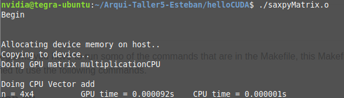
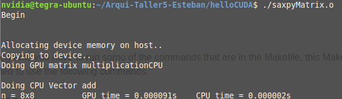
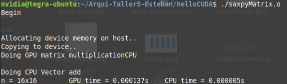
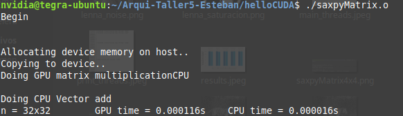
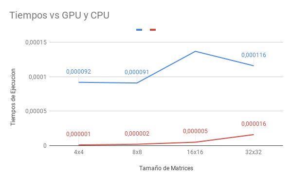

# Arqui-Taller5

## Usage
For use this programs you have to run somo of the commands that are in the Makefile, this Makefile was taken from [here](https://github.com/jefg89/helloCUDA) and was modified to use the following commands.

### multiplicacion.cu
This file does a multiplicaction of two matrixes of 4x4. The command to build the excecutable is:

```bash 
make multiplicacion
./multiplicacion.o
```
### saxpyMatrix.cu
This file does a saxpy algorithm with two matrixes. The commando to build the executable is:

```bash 
make saxpyMatrix
./saxpyMatrix.o
```

## Saxpy Matrix
### Matrix 4x4


### Matrix 8x8


### Matrix 16x16


### Matrix 32x32


### Statistics
The blue line is for the GPU and the red line is for the CPU.

